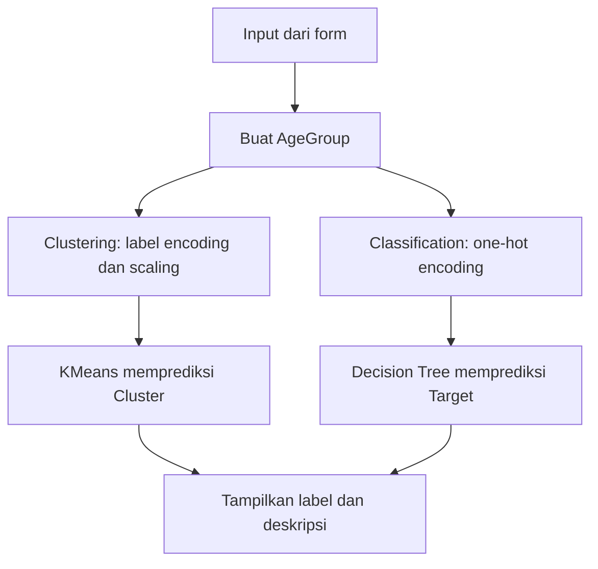

# Bank Transaction Model Transaction

## Project Overview

[...]

## Business Problem

[...]

## Business Questions

[...]

## Data Preparation

[...]

## Tools

[...]

## Project Workflow

## Key Insights

[...]

## Deliverables

[...]

## Author

**Muchammad Wildan Alkautsar** - Data Scientist
